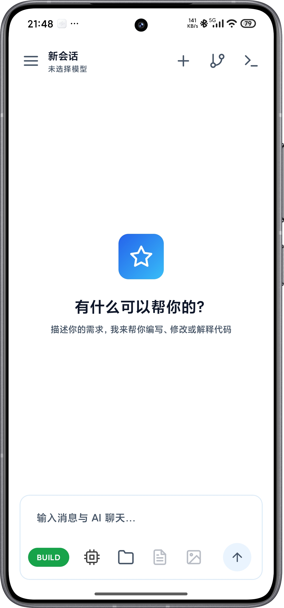
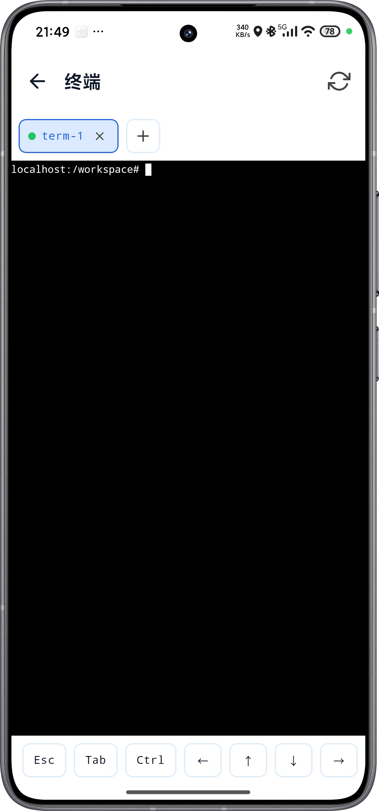

<p align="center">
  <h1 align="center">DeepCore-Code</h1>
  <p align="center">
    AI-powered coding assistant for Android · Built-in Linux terminal · AI Agent · MCP · Git integration
    <br />
    <a href="README.md">中文</a> · <a href="README.en.md">English</a>
  </p>
</p>

<p align="center">
  <a href="LICENSE"></a>
  
  
  
  
  <a href="https://github.com/Lisir2002/deepcode-R/actions"></a>
  <a href="https://github.com/Lisir2002/deepcode-R/releases/latest"></a>
  <a href="https://github.com/Lisir2002/deepcode-R/releases"></a>
</p>

<p align="center">
  <table>
    <tr>
      <td align="center"></td>
      <td align="center"></td>
    </tr>
    <tr>
      <td align="center">Home · AI Chat</td>
      <td align="center">Terminal · Alpine Linux</td>
    </tr>
  </table>
</p>

---

## Table of Contents

- [Overview](#overview)
- [Features](#features)
- [Installation](#installation)
- [Quick Start](#quick-start)
- [For Developers: Build & Test](#for-developers-build--test)
- [Tech Stack](#tech-stack)
- [Project Structure](#project-structure)
- [Documentation](#documentation)
- [Known Limitations](#known-limitations)
- [Contributing](#contributing)
- [Acknowledgements](#acknowledgements)
- [License](#license)

## Overview

DeepCore-Code is an AI-powered coding assistant that runs natively on Android. It integrates large language models with a local Linux development environment. The built-in Alpine Linux container and terminal emulator let the AI directly read/write files, execute shell commands, and run build tools. It also supports remote SSH servers as the execution backend, turning your phone into a mobile workstation for remote projects.

## Features

- **AI Agent** — Supports Anthropic (Claude), OpenAI (GPT), Gemini, and other providers. Deeply interacts with the dev environment via **20+ built-in tools** (file read/write/edit, shell execution, terminal management, web search/fetch, image generation, MCP management, etc.). Supports streaming output, context compression, multi-session management, and PLAN/BUILD/AUTO execution modes
- **Permission & Safety** — Seven-layer permission evaluation engine: catastrophic command interception, PLAN-mode read-only constraints, shell static analysis, built-in read-only whitelist, user approval and rule memory
- **Checkpoints & Rollback** — Automatic file snapshots before modifications, with rollback to any checkpoint
- **Built-in Terminal** — Based on Termux components + PRoot Alpine Linux container, providing a full Linux command-line environment with background persistence, multi-tab management, and **7 built-in bundles** (Python/Node/Git/Bash/rg/Network tools/QEMU x86 translator)
- **Remote SSH Mode** — Connect to a remote SSH server as the execution backend. Commands via exec channel, file I/O via exec + cat/base64, terminal via shell channel, with auto-reconnect and status indicator
- **MCP Protocol** — Model Context Protocol client, connecting to local (stdio) or remote (HTTP) MCP servers to dynamically extend tool capabilities
- **Git Integration** — Built-in visual Git operations (status/branches/commits/tags/graph), with unified credential management across three endpoints (UI Git / AI Bash / terminal git)
- **Remote Sync** — SFTP / FTP workspace sync, with a built-in FTP server for desktop access
- **Backup & Restore** — AES-256-GCM encrypted full data backup (sessions/config/credentials/workspace), with optional passphrase protection
- **Markdown Rendering** — Real-time Markdown rendering in AI conversations, with code highlighting
- **Custom Prompts** — System prompts support user-defined overrides, preserved across app upgrades

## Installation

> DeepCore-Code is distributed as an APK. **No compilation needed** — just download and install.

1. Go to the [Releases page](https://github.com/Lisir2002/deepcode-R/releases) and download the latest APK (`deepcode-<tag>.apk` — one universal package for both physical devices and emulators).
2. Transfer the APK to your phone/emulator (browser download / cloud drive / USB).
3. Tap the APK to install. If prompted about "unknown sources", allow "Install unknown apps" in system settings (path varies by brand).

**Prerequisites**

- **Physical device (officially supported)**: Android 8.0+ (API 26) **arm64-v8a** device (the mainstream ABI for current Android handsets)
- **Virtual environment (emulator / VM)**: x86_64 or arm64 system images both work — the same universal package installs and runs; the container auto-selects by host architecture (x86_64 → native x86_64 proot, arm64 → native execution); see [docs/plan-docs/emulator-support-design.md](docs/plan-docs/emulator-support-design.md)

## Quick Start

1. **Add an AI provider**: Go to "Settings → AI Providers" and add an API key for Anthropic (Claude) / OpenAI (GPT) / Gemini.
2. **Start chatting**: Return to the home screen and describe what you need; the AI can read/write files and run commands. Use the **PLAN / BUILD / AUTO** execution modes to control how much freedom the AI has.
3. **Use the terminal**: Open the "Terminal" tab and install the built-in bundles you need (Python / Node / Git / Bash, etc.) for a full Linux command-line environment.
4. **Connect remote**: Configure a remote SSH server in Settings to turn your phone into a mobile workstation for remote projects.
5. **Extend capabilities**: Add MCP servers to dynamically extend tools; connect the built-in browser so the AI can read pages behind your login session.

> 💡 For more details, see the in-app help (Settings → Help) and the [Documentation](#documentation) section.

## For Developers: Build & Test

### Prerequisites

- **JDK 17**

### Build

```bash
# Daily dev smoke build (recommended, debug APK only; faster, no R8)
./gradlew :app:assembleDebug

# Release build (signing config required; auto-falls back to debug keystore when missing)
./gradlew assembleRelease
# Output: app/build/outputs/apk/release/app-release.apk (dual-ABI universal package: arm64-v8a + x86_64)

# Release AAB
./gradlew bundleRelease
# Output: app/build/outputs/bundle/release/app-release.aab
```

<details>
<summary>Release signing configuration</summary>

Add to `app/keystore.properties`:

```properties
storeFile=deepcode.jks
storePassword=your_password
keyAlias=your_alias
keyPassword=your_key_password
```

> `storeFile` path is customizable (filename not fixed). CI restores it from secrets to `app/deepcode.jks`. When signing config is not present, release build auto-falls back to the debug keystore, so `assembleRelease` always produces an APK.

</details>

### Test

```bash
# Unit tests on release classpath (matches CI gate & user runtime; recommended)
./gradlew :app:testReleaseUnitTest
# Unit tests on debug classpath
./gradlew :app:testDebugUnitTest
```

### Cloud build (GitHub Actions release automation)

Releases are tag-driven: push a `v*` tag on a `main` commit (e.g. `git push origin v0.1.0-rc1` / `v0.1.0`) and [`.github/workflows/android-release.yml`](.github/workflows/android-release.yml) takes over automatically → unit tests → `assembleRelease` → production signing → **dual-ABI artifact validation** → upload R8 mapping → create GitHub Release → attach `deepcode-<tag>.apk` → write Run Summary. RC tags (containing `-rc`) are auto-marked as prerelease.

- **Production-signing prerequisite**: the repository `Settings → Secrets → Actions` must define 4 secrets — `AICODE_KEYSTORE_BASE64` / `AICODE_KEYSTORE_PASSWORD` / `AICODE_KEY_ALIAS` / `AICODE_KEY_PASSWORD`. Missing any one silently falls back to the debug keystore, and the artifact cannot be published.
- **Real-time monitoring & artifact verification**, full commands, and CI job details: see [docs/ci-release.md](./docs/ci-release.md) (cloud build & release operations manual).
- **Release page**: https://github.com/Lisir2002/deepcode-R/releases

## Tech Stack

| Category | Technology |
|----------|------------|
| Language | Kotlin 2.2.21 |
| Build | Android Gradle Plugin 8.9.3 + KSP |
| UI | Jetpack Compose (BOM 2025.12.01) + Material 3 |
| DI | Hilt 2.56.1 (Dagger) |
| Database | Room 2.7.1 (split by domain into 5 DBs: agent v4 / settings / credentials / workspace / t2i; legacy single-DB file-driven SQL migration only for historical reads) |
| Network | Retrofit 2.11.0 + OkHttp 4.12.0 + Gson |
| Async | Kotlin Coroutines / Flow |
| Terminal | Termux terminal-emulator + terminal-view (JNI libtermux.so) |
| Container | PRoot + Alpine Linux 3.21 rootfs (arm64-v8a / x86_64) |
| Remote SSH | SSHJ 0.38.0 (exec channel + shell channel) |
| Crypto | BouncyCastle bcprov-jdk18on 1.75 + Android Keystore AES-GCM |
| FTP | Apache Commons Net 3.10.0 |
| Compression | Apache Commons Compress 1.26.2 (tar.gz / XZ) |
| Serialization | Gson + kotlinx.serialization |

## Project Structure

```
app/src/main/java/com/core/deepcode/
├── core/                # Core infrastructure (FileLogger, AILogger, db/MigrationLoader, CredentialEncryptor, LineDiff, theme)
├── di/                  # Hilt DI (AgentModule, RepositoryModule, BackupModule)
├── feature/
│   ├── agent/           # AI Agent (MVI workflow, 20+ tools, permission engine, MCP, skills, memory, checkpoints, provider adapters)
│   ├── backup/          # AES-encrypted backup & restore
│   ├── browser/         # Built-in browser (WebView sessions, login takeover, dynamic data capture)
│   ├── capability/      # Capability hub (aggregated tools/agents/skills view)
│   ├── credentials/     # Git credential management (3-endpoint IPC bridge, file sync, global dialog)
│   ├── git/             # Git visualization (status/branches/commits/tags/graph/diff)
│   ├── proxy/           # Network proxy (mihomo core, subscriptions, routing injection)
│   ├── settings/        # App settings (AI provider management, container, MCP, remote, logs, etc.)
│   ├── t2i/             # Text-to-image (provider abstraction, SYNC/ASYNC/AUTO endpoints)
│   ├── terminal/        # Terminal emulation & session management (local PRoot + remote SSH, 7 built-in bundles)
│   └── workspace/       # Workspace & document management (local + remote SFTP/FTP sync)
├── AIEditorApp.kt       # Application entry (BC registration, credential bridge, MCP, keepalive init)
└── MainActivity.kt      # Main Activity (NavHost + Drawer + global credential dialog)
```

> Detailed per-module developer docs: see [docs/modules/](./docs/modules/README.md) (one doc per module: responsibilities, architecture, interfaces, maintenance guide).

## Documentation

| Document | Description |
|---|---|
| [docs/modules/README.md](./docs/modules/README.md) | **Module docs index**: one document per feature module (architecture, interfaces, maintenance guide) |
| [docs/plan-docs/](./docs/plan-docs/) | **Design docs**: architecture/feature design proposals (with review status), e.g. [Virtual environment support](./docs/plan-docs/emulator-support-design.md) |
| [AGENTS.md](./AGENTS.md) | **AI collaboration guidelines**: asset sync discipline, Conventional Commits, branching workflow, release process |
| `app/src/main/assets/docs/` | In-app help documents (viewable at runtime via Settings → Help) |

## Known Limitations

- `targetSdk` is locked to 28 to bypass Android 10+ W^X policy, enabling PRoot execution; trade-off: ineligible for Google Play (same as Termux).
- Release artifacts are **dual-ABI universal** packages (arm64-v8a + x86_64):
  - Supports all mainstream Android physical devices (Snapdragon/Dimensity/Kirin and other 64-bit ARM chipsets) plus x86_64 / arm64 emulators and VMs;
  - On an extremely rare host ABI (neither arm64 nor x86_64) the container is unavailable; the AI core (chat / files / remote SSH) still works, while container/terminal show an explicit degradation notice.

## Contributing

Issues and PRs are welcome. Please follow the rules in [AGENTS.md](./AGENTS.md): Conventional Commits, asset sync discipline (UI strings go to `strings.xml`, code changes sync module docs, etc.). Enable local validation before committing: `git config core.hooksPath .githooks`.

## Acknowledgements

- [OpenCode](https://github.com/anomalyco/opencode) — Terminal-based AI coding tool, the core inspiration for this project
- [Termux](https://github.com/termux/termux-app) — Android terminal emulator, provided terminal components and PRoot solution
- [Kelivo](https://github.com/Chevey339/kelivo) — Cross-platform LLM chat client, AI conversation UI design reference

## License

This project is licensed under [GPL-3.0](LICENSE).
